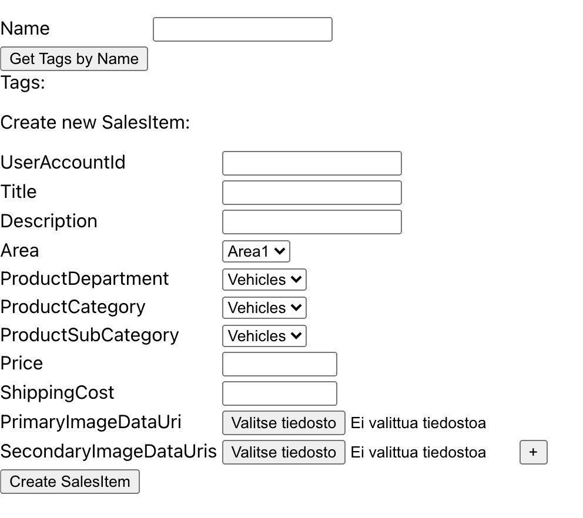

# Backk Example Frontend

Backk example frontend is a React app that uses backk-example-microservice's generated client to connect to [backk-example-microservice](https://github.com/backk-node/backk-example-microservice)
The generated client is copied from backk-example-microservice to `src/services/backk-example-microservice.default`.
`backk-example-microservice.default` is the namespaced microservice for `backk-example-microservice`, where `default` is the Kubernetes namespace of the microservice.
If your frontend wants to use other microservices, you can copy more generated clients to directory `src/services`.

Copying a generated client manually is just one way of using generated clients, other possibilities in your frontend client project are:
- You can reference the directory in the microservice containing the generated client directly from the frontend client project if you are using a monorepo
- You can create a git submodule or subtree that references the microservice repo containing the generated client code
- If your microservice's CI pipeline publish generated clients as NPM packages, you can install the needed NPM packages in your frontend client project

## Starting Example Frontend
1. Clone backk-example-frontend to a local directory
2. Run `npm install`
3. Run `npm start`
4. Start [backk-example-microservice](https://github.com/backk-node/backk-example-microservice)
5. Change the URL of frontend in the browser to `http://localhost:3001/?serverPort=3000`, or use the port that backk-example-microservice is using if it is not 3000.
6. Now you can use the user-interface to query Tags by name filter and create new sales items. When new sales item is created, you will have possibility to update the sales item.



## Production
Generated client(s) must be configured with microservices' Kubernetes Cluster Edge FQDN
Each generated client has `MicroserviceOptions`class in `_backk` directory.
FQDN can be configured:

```ts
MicroserviceOptions.setFqdn('give FQDN here')
```

If FQDN is not configured, `localhost` will be used as default.

## Authorization
Generated client(s) must be configured with Access Token storage encryption key.
Generated clients assume that Access Token is stored in Session Storage with key `accessToken`
Generated clients assume that Access Token is encrypted.

Encryption key can be set:
```ts
MicroserviceOptions.setAccessTokenStorageEncryptionKey('give encryption key here')
```

## Functionality

Backk example frontend has implemented a form and input component that are easy to use.
Backk example frontend uses [universal-mode-react](https://github.com/universal-model/universal-model-react) as state management solution.
For example, You can create a form for creating a new sales item with following code:

```tsx
import React from 'react';
import SalesItem from '../../../services/backk-example-microservice.default/salesitem/types/entities/SalesItem';
import createSalesItem from '../model/actions/createSalesItem';
import store from '../../../store/store';
import Form from '../../common/form/Form';

const salesItem = new SalesItem();
const { salesItemState } = store.getState();

function MyNumberInput(props: any) {
  return <input {...props} style={{ backgroundColor: 'lightyellow'}}/>;
}

export default function CreateSalesItem() {
  store.useState([salesItemState]);

  return (
    <Form
      Class={SalesItem}
      instance={salesItem}
      serviceFunctionType={'create'}
      forceImmediateValidationId={salesItemState.forceImmediateCreateFormValidationId}
      error={salesItemState.salesItemCreationError}
      onSubmitForm={createSalesItem}
      InputTypeToInputComponentMap={{
        number: MyNumberInput
      }}
    />
  );
}
```

By default `Form` renders browser's standard HTML inputs, but you can instruct the form to use your custom components by defining the `InputTypeToInputComponentMap` property.
In above example, we define that inputs with type 'number' should be rendered using `MyNumberInput` component, which is the same as standard HTML input, but with a light yellow background
You should keep in mind that your custom input components should comply with standard inputs' API (attributes and event handlers)
